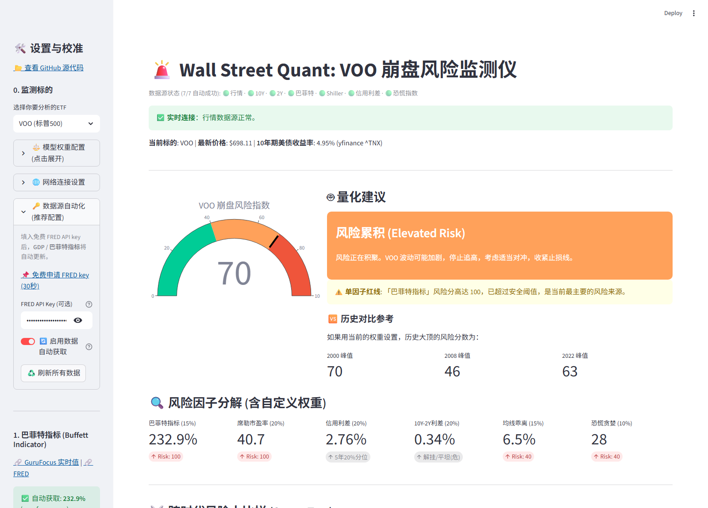

# 🚨 Wall Street Quant: US Stock Crash Monitor

> **Version v1.3 ｜ Last Updated 2026-09-17**
> A full-stack quantitative analysis tool built with Python and Streamlit. It integrates macroeconomic indicators and technical analysis to monitor crash risks for the S&P 500 (VOO) and Nasdaq 100 (QQQ) in real-time.

### [**🇨🇳 View Chinese Version / 中文文档**](https://github.com/middletoo/US_Stock_Crash_Monitor/blob/main/README.md)



---

## 📖 Introduction

In financial markets, single indicators can often be deceptive. This project aims to build a **Multi-factor Risk-Weighted Model**. By integrating Wall Street's most-watched macro valuation metrics (e.g., the Buffett Indicator, Shiller PE) with technical indicators (e.g., Moving Average Deviation, Treasury Yield Curve), it calculates a comprehensive **"Crash Risk Score."**

The tool helps investors stay rational during periods of extreme market euphoria and identify opportunities during extreme panic, avoiding the "herd mentality."

---

## 🆕 What's New in v1.3

**Core theme: the risk model moves from "linear weighting" to "six factors + nonlinearity + resonance detection", closer to how crashes actually unfold.**

* 🧠 **New 6th factor — Credit Spread (High-Yield OAS)**: an orthogonal "smart money" signal that does **not overlap** with the equity-side factors (valuation/sentiment/technical). Credit markets are priced by institutions and often widen 1-2 months before equities crash (2008/2020). Data from FRED `BAMLH0A0HYM2` (free key required).
* 📊 **Percentile-based scoring**: factors with historical series (e.g., credit spread) now use a **5-year rolling percentile**, auto-adapting to regime shifts and fixing stale static thresholds.
* 📈 **Nonlinear amplification**: a power transform makes extreme readings contribute nonlinearly (matching the nonlinear nature of crashes).
* 🔴 **Resonance alert**: when ≥3 factors simultaneously enter their historical extreme zone, a red alert fires and adds bonus points — multi-factor blowouts are the classic crash signature.
* 🚩 **Max-single-factor redline floor**: prevents one extreme factor from being diluted by mild ones (e.g., credit spread blowing out during 2008 Lehman while others stayed calm); a blowout factor now floors the total score.
* 🧩 **New "Factor Contribution" chart**: shows how many risk points each factor actually contributes, revealing the dominant risk source at a glance.
* 📉 **New "Risk Score Trend" chart**: each run accumulates the day's score locally and plots its evolution over time — upgrading the tool from a snapshot to a true monitor.
* 📈 **Chart upgrade**: candlestick chart now includes a volume subplot and a 50-day MA with red/green coloring.
* 🧹 **Refactor**: scoring logic extracted into a standalone `risk_model.py`; eliminated duplicate market-data downloads; removed redundant dependencies and dead code.

> ⚠️ **Weights**: v1.3 uses six factors with **auto-normalized weights** (no need to sum to 100%). Historical benchmarks (2000/2008/2022) recomputed under the new model: 2000 peak = 70 / pre-2008 = 46 / 2022 peak = 63.

<details>
<summary>📜 View v1.2 changelog</summary>

**v1.2 core theme: full data-source automation — no more manual lookups.**

* ✨ **All indicators auto-fetched**: The 5 metrics that previously required manual lookup and entry (2Y Treasury yield, US GDP, Buffett Indicator, Shiller PE, Fear & Greed Index) are now fully automated — live data on startup.
* 📡 **New `data_fetcher.py` module**: A unified layer managing 7 external data sources, each with a complete "auto-fetch → cache → multi-level fallback" pipeline.
* 🔁 **Three-tier failover**: If any source fails, it automatically switches to a backup (e.g., Buffett Indicator: GuruFocus scraping → FRED computation → manual input), so it always produces a value.
* 🔑 **FRED official data**: Provide a free FRED API key and US GDP + Buffett Indicator come straight from the Federal Reserve's official database (authoritative and timely).
* ✏️ **Auto + Manual dual mode**: Every indicator auto-fetches (green ✅ with source label), with a "manual override" toggle beside it — automation with full flexibility.
* 📊 **Data-source status bar**: The page header shows live connectivity per source (🟢/🔴), plus a one-click "♻️ Refresh All Data" button.
* 🛡️ **API key safety**: Keys are configured locally via `.env` and protected by `.gitignore` — never committed to the repo.

</details>

---

## ✨ Core Features

* **Multi-dimensional Quantitative Model**: More than price tracking — a comprehensive scoring system combining **Macro**, **Valuation**, **Sentiment**, and **Technical** factors.
* **Dual Asset Switching**: Seamlessly switch between **VOO (S&P 500)** and **QQQ (Nasdaq 100)**, with independent analysis for assets of different volatility profiles.
* **Full Data Automation**: 7 indicators auto-fetched with no manual entry; automatic fallback on network failures, adapted for restricted network environments.
* **High Customizability**:
  * **Weight Adjustment**: Dynamically adjust each indicator's weight based on the current market environment (e.g., high-interest-rate or AI-bubble conditions).
  * **Manual Calibration**: Every indicator supports one-click switching to manual input for flexible overrides.
* **Historical Comparison**: Threshold references and cross-era risk-score comparisons for key historical crashes (2000, 2008, 2022).
* **Interactive Charts**: High-performance interactive candlestick charts and risk dashboards rendered with Plotly.

---

## 📡 Data Sources

All indicators are auto-fetched (v1.3). Sources have been verified for direct reachability:

| Indicator | Auto Source | Direct Access | Fallback | Key Required |
|-----------|-------------|:------------:|----------|:------------:|
| ETF Price / 200-day MA | yfinance (VOO/QQQ) | ✅ | Mock data | No |
| 10Y Treasury Yield | yfinance `^TNX` | ✅ | CNBC / akshare | No |
| 2Y Treasury Yield | CNBC API | ✅ | akshare | No |
| High-Yield Credit Spread (v1.3) | FRED `BAMLH0A0HYM2` | ✅* | Manual input | **Yes** |
| US GDP | FRED API | ✅* | Manual input | **Yes** |
| Buffett Indicator (Cap/GDP) | GuruFocus scraping | ✅ | FRED computation | No |
| Shiller PE (CAPE) | multpl.com scraping | ✅ | Manual input | No |
| Fear & Greed Index | CNN dataviz API | ✅ | Manual slider | No |

\* The FRED web domain (fred.stlouisfed.org) is blocked in some regions, but the **API domain (api.stlouisfed.org) is directly reachable**, so the official API is used.

> 💡 **About the FRED key**: the tool works fine without one — the Buffett Indicator falls back to GuruFocus scraping, and GDP + credit spread (low-frequency or non-critical) can be entered manually. With a key, all indicators are fully automated and the credit spread gets a 5-year percentile score.

---

## 🛠️ Monitoring Indicator System

The model calculates risk from 6 core factors (v1.3, weights adjustable and auto-normalized):

1. **Buffett Indicator**: Total US Market Cap / US GDP. Measures the overall degree of the stock market bubble.
2. **Shiller PE (CAPE)**: Inflation-adjusted cyclically adjusted price-to-earnings ratio; a valuation benchmark that spans bull and bear markets.
3. **High-Yield Credit Spread (HY OAS)** 🆕: an orthogonal "smart money" signal. Credit markets are institution-priced and often widen 1-2 months before equities crash. Scored on a 5-year historical percentile.
4. **Treasury Yield Curve (10Y-2Y Spread)**: A famous recession warning indicator, specifically monitoring the high-risk moment when the curve "uninverts" after a period of inversion.
5. **200-Day Moving Average Deviation**: Measures how much the short-term price deviates from the long-term trend to determine if an asset is severely overbought.
6. **Fear & Greed Index**: A contrarian indicator; extreme greed often signals a short-term market top. (It already embeds VIX / Put-Call / momentum / breadth sub-indices, so those are not added separately.)

**Scoring (v1.3)**: six-factor percentile scoring + nonlinear amplification + **resonance alert** (bonus when multiple factors are simultaneously extreme) + **max-single-factor redline floor** (prevents one extreme signal from being diluted). This better matches the nonlinear nature of crashes than v1.2's plain linear weighting.

---

## 🚀 Quick Start

### Prerequisites

* Python 3.8 or higher

### Installation Steps

**1. Clone the Repository**
```bash
git clone https://github.com/middletoo/US_Stock_Crash_Monitor.git
cd US_Stock_Crash_Monitor
```

**2. Install Dependencies**
```bash
pip install -r requirements.txt
```

**3. (Optional but recommended) Configure a FRED API key for full automation**

The Buffett Indicator and US GDP use FRED official data, which requires a free key:

* Get a free key in 30 seconds: https://fred.stlouisfed.org/docs/api/api_key.html
* Copy `.env.example` to `.env` and fill in your key:
  ```
  FRED_API_KEY=your_key_here
  ```
* **It works without a key too**: the Buffett Indicator automatically falls back to GuruFocus scraping; only GDP needs manual entry.

**4. Run the Application**
```bash
streamlit run app.py
```

**5. Access the App**

The browser will automatically open http://localhost:8501

### How to Use

1. **Out of the box**: on startup all indicators auto-fetch live data; the header shows source status (all 🟢 = fully automated).
2. **Refresh data**: data is cached for 30 minutes; click "♻️ Refresh All Data" in the sidebar to force an update.
3. **Adjust weights**: expand "⚖️ Model Weight Configuration" and drag sliders for the current environment (v1.3 auto-normalizes — no need to sum to 100%).
4. **Manual calibration**: tick "✏️ Manual override" on any indicator to override its auto value (e.g., a source you trust more).
5. **Network issues**: if Yahoo Finance fails, enter a proxy under "🌐 Network Settings", or leave it blank to auto-enter Demo Mode.
6. **Switch asset**: pick VOO (S&P 500) or QQQ (Nasdaq 100) at the top of the sidebar.

---

## ⚠️ Limitations

* **Data Lag**: GDP is updated quarterly, so the Buffett Indicator cannot reflect real-time intraday changes — better for long-term trends than short-term timing.
* **Bounded Nonlinearity**: v1.3 adds percentile scoring, resonance alerts, and a redline floor, but it remains a rules-based score (not machine learning). It cannot time a "Black Swan" precisely — it measures **fragility**, not the **trigger moment**.
* **Percentile Dependence**: percentile scoring (e.g., credit spread) depends on the length of available history; when a series only covers recent years, the percentile reference is less reliable.
* **Scraping Fragility**: Shiller PE / Buffett Indicator / Fear & Greed rely on third-party pages or private APIs; if a target site changes its markup, parsing may fail (fallbacks and manual overrides are built in).
* **Subjective Factors**: although the data is automated, weight settings and per-factor thresholds still involve some subjectivity.

---

## 🛡️ Disclaimer

**This project is for programming education and quantitative research purposes only. It does not constitute any investment advice.**

* Financial markets involve significant risk; invest with caution.
* The "Risk Score" provided by this tool is based on historical statistical data; past performance does not guarantee future results.
* The author is not responsible for any financial losses resulting from the use of this code.

---

**If you find this project helpful, please give it a ⭐️ Star!**
